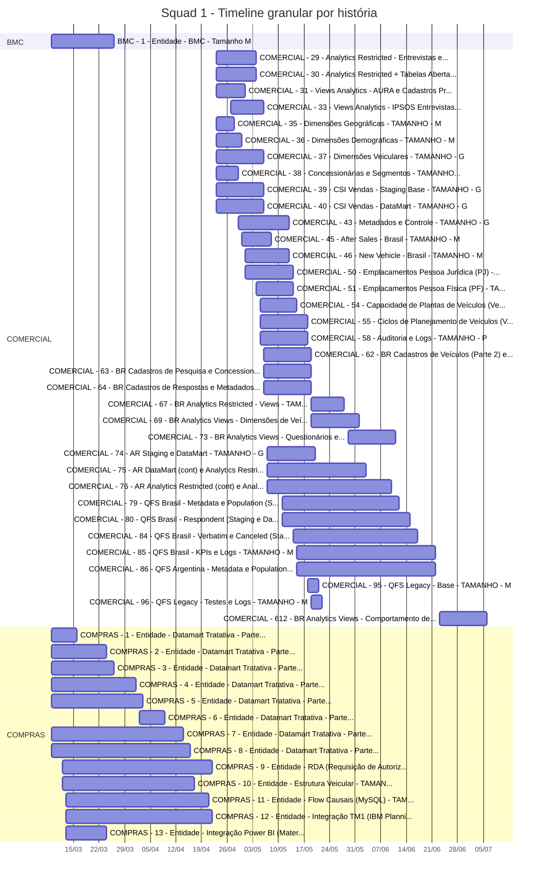

# Timeline granular por história

Base: `analises/prazo_squads_dividido_alocacoes.csv`
Regra: cada barra representa a história consolidada (início mínimo e fim máximo entre Engenheiro/Analista).

## Squad 1

## Squad 2

```mermaid
gantt
    title Squad 2 - Timeline granular por história
    dateFormat  YYYY-MM-DD
    axisFormat  %d/%m

    section MOPAR
    MOPAR - 1 - Assunto - AgendamentoOnline - TAMANHO... : squad_2_mopar_1, 2026-04-01, 2026-04-14
    MOPAR - 2 - Assunto - Bonus - TAMANHO - G : squad_2_mopar_2, 2026-04-01, 2026-04-08
    MOPAR - 3 - Assunto - Claim Master - TAMANHO - M : squad_2_mopar_3, 2026-04-01, 2026-04-07
    MOPAR - 4 - Assunto - Comissionamento DFS - TAMAN... : squad_2_mopar_4, 2026-04-01, 2026-04-09
    MOPAR - 5 - Assunto - CSPS - Parte 1 - TAMANHO - G : squad_2_mopar_5, 2026-04-01, 2026-04-09
    MOPAR - 6 - Assunto - CSPS - Parte 2 - TAMANHO - G : squad_2_mopar_6, 2026-04-01, 2026-04-15
    MOPAR - 7 - Assunto - Mopar Results - TAMANHO - M : squad_2_mopar_7, 2026-04-01, 2026-04-10
    MOPAR - 8 - Assunto - NDC - Parte 1 - TAMANHO - G : squad_2_mopar_8, 2026-04-01, 2026-04-09
    MOPAR - 9 - Assunto - NDC - Parte 2 - TAMANHO - G : squad_2_mopar_9, 2026-04-03, 2026-04-14
    MOPAR - 10 - Assunto - NDC - Parte 3 - TAMANHO - M : squad_2_mopar_10, 2026-04-08, 2026-04-16
    MOPAR - 11 - Assunto - SCP - Parte 1 - TAMANHO - M : squad_2_mopar_11, 2026-04-09, 2026-04-17
    MOPAR - 12 - Assunto - SCP - Parte 2 - TAMANHO - M : squad_2_mopar_12, 2026-04-09, 2026-04-20
    MOPAR - 13 - Assunto - SCP - Parte 3 - TAMANHO - M : squad_2_mopar_13, 2026-04-10, 2026-04-21
    MOPAR - 14 - Assunto - Sell IN xF e xP - TAMANHO - G : squad_2_mopar_14, 2026-04-10, 2026-04-22
    MOPAR - 15 - Assunto - SELL OUT xF e xP - TAMANHO - G : squad_2_mopar_15, 2026-04-13, 2026-04-28
    MOPAR - 16 - Assunto - Veiculo Conectado - TAMANHO... : squad_2_mopar_16, 2026-04-13, 2026-04-27
    MOPAR - 17 - Entidade - Ingestão Staging SG Liquid... : squad_2_mopar_17, 2026-04-14, 2026-04-17
    MOPAR - 18 - Entidade - Ingestão Staging Claims e... : squad_2_mopar_18, 2026-04-14, 2026-04-15
    MOPAR - 19 - Entidade - Ingestão Staging User Para... : squad_2_mopar_19, 2026-04-15, 2026-04-24
    MOPAR - 20 - Entidade - Ingestão Staging IRPV  Red... : squad_2_mopar_20, 2026-04-15, 2026-04-22
    MOPAR - 21 - Entidade - Ingestão Staging Carga Fri... : squad_2_mopar_21, 2026-04-15, 2026-04-16
    MOPAR - 22 - Entidade - SG Liquidadas Principal e... : squad_2_mopar_22, 2026-04-15, 2026-05-01
    MOPAR - 23 - Entidade - SG Liquidadas Operações  D... : squad_2_mopar_23, 2026-04-16, 2026-05-01
    MOPAR - 24 - Entidade - Claims GCS - TAMANHO - P : squad_2_mopar_24, 2026-04-16, 2026-05-04
    MOPAR - 25 - Entidade - Erros SG - TAMANHO - P : squad_2_mopar_25, 2026-04-17, 2026-05-04
    MOPAR - 26 - Entidade - User Parameters Tipos  Ano... : squad_2_mopar_26, 2026-04-17, 2026-05-08
    MOPAR - 27 - Entidade - User Parameters Grupos  Lo... : squad_2_mopar_27, 2026-04-20, 2026-04-23
    MOPAR - 28 - Entidade - Garantia Revisões DataStag... : squad_2_mopar_28, 2026-04-20, 2026-05-05
    MOPAR - 29 - Entidade - IRPV MySQL - TAMANHO - M : squad_2_mopar_29, 2026-04-21, 2026-05-08
    MOPAR - 30 - Entidade - IRPV2 Consolidação - TAMAN... : squad_2_mopar_30, 2026-04-22, 2026-05-11
    MOPAR - 31 - Entidade - Red Dealers - TAMANHO - M : squad_2_mopar_31, 2026-04-22, 2026-05-12
    MOPAR - 32 - Assunto - Click - Parte 1 - TAMANHO - G : squad_2_mopar_32, 2026-04-23, 2026-05-13
    MOPAR - 33 - Assunto - Click - Parte 2 - TAMANHO - G : squad_2_mopar_33, 2026-04-23, 2026-05-14
    MOPAR - 34 - Assunto - Click - Parte 3 - TAMANHO - G : squad_2_mopar_34, 2026-04-23, 2026-05-19
    MOPAR - 35 - Assunto - Click - Parte 4 - TAMANHO - G : squad_2_mopar_35, 2026-04-23, 2026-05-18
    MOPAR - 36 - Assunto - Click - Parte 5 - TAMANHO - G : squad_2_mopar_36, 2026-04-24, 2026-05-22
    MOPAR - 37 - Assunto - Click - Parte 6 - TAMANHO - G : squad_2_mopar_37, 2026-04-24, 2026-05-22
    MOPAR - 38 - Assunto - Click - Parte 7 - TAMANHO - M : squad_2_mopar_38, 2026-04-24, 2026-05-26
    MOPAR - 39 - Assunto - Click - Parte 8 - TAMANHO - P : squad_2_mopar_39, 2026-04-27, 2026-05-25

    section RH
    RH - 1 - Entidade - Vetorh - Estruturas Organi... : squad_2_rh_1, 2026-05-27, 2026-06-09
    RH - 2 - Entidade - Vetorh - Cargos e Vínculos... : squad_2_rh_2, 2026-05-27, 2026-06-09
    RH - 3 - Entidade - Vetorh - Dados de Colabora... : squad_2_rh_3, 2026-05-27, 2026-06-09
    RH - 4 - Entidade - Vetorh - View PCD - TAMANH... : squad_2_rh_4, 2026-05-27, 2026-05-27
    RH - 5 - Entidade - Vetorh - Históricos de Mov... : squad_2_rh_5, 2026-05-27, 2026-06-09
    RH - 6 - Entidade - Vetorh - Ponto e Jornada P... : squad_2_rh_6, 2026-05-27, 2026-06-09
    RH - 7 - Entidade - Vetorh - Ponto e Jornada P... : squad_2_rh_7, 2026-05-27, 2026-05-28
    RH - 8 - Entidade - Vetorh - Saúde e Segurança... : squad_2_rh_8, 2026-05-27, 2026-06-09
    RH - 9 - Entidade - Vetorh - Saúde e Segurança... : squad_2_rh_9, 2026-05-27, 2026-05-27
    RH - 10 - Entidade - Vetorh - Saúde e Segurança... : squad_2_rh_10, 2026-05-28, 2026-06-08
    RH - 11 - Entidade - Vetorh - Medicina do Traba... : squad_2_rh_11, 2026-05-29, 2026-06-10
    RH - 12 - Entidade - Vetorh - Views Absenteísmo... : squad_2_rh_12, 2026-05-28, 2026-06-01
    RH - 13 - Entidade - Vetorh - Treinamento - TAM... : squad_2_rh_13, 2026-06-09, 2026-06-18
    RH - 14 - Entidade - Vetorh - Views Medicina An... : squad_2_rh_14, 2026-06-01, 2026-06-02
    RH - 15 - Entidade - Vetorh - Riscos Ambientais... : squad_2_rh_15, 2026-06-10, 2026-06-22
    RH - 16 - Entidade - Vetorh - Tabelas Usuário P... : squad_2_rh_16, 2026-06-02, 2026-06-18
    RH - 17 - Entidade - Vetorh - Tabelas Usuário P... : squad_2_rh_17, 2026-06-03, 2026-06-12
    RH - 18 - Entidade - Vetorh - Tabelas Usuário P... : squad_2_rh_18, 2026-06-10, 2026-06-18
    RH - 19 - Entidade - Vetorh - Tabelas Usuário P... : squad_2_rh_19, 2026-06-03, 2026-06-18
    RH - 20 - Entidade - Vetorh - Tabelas Usuário P... : squad_2_rh_20, 2026-06-08, 2026-06-16
    RH - 21 - Entidade - Vetorh - Tabelas Usuário F... : squad_2_rh_21, 2026-06-09, 2026-06-22
    RH - 22 - Entidade - Vetorh - Views Cross Parte... : squad_2_rh_22, 2026-06-09, 2026-06-22
    RH - 23 - Entidade - Vetorh - Views People Anal... : squad_2_rh_23, 2026-06-11, 2026-06-18
    RH - 24 - Entidade - Vetorh - Views Medicina e... : squad_2_rh_24, 2026-06-19, 2026-06-29
    RH - 25 - Entidade - Vetorh - Views Segurança e... : squad_2_rh_25, 2026-06-23, 2026-06-29
    RH - 26 - Entidade - Vetorh - Views Manufacturi... : squad_2_rh_26, 2026-06-30, 2026-07-09
    RH - 27 - Entidade - Vetorh - Views Qualidade e... : squad_2_rh_27, 2026-06-30, 2026-07-09
    RH - 28 - Entidade - Vetorh - Views NEA e Telet... : squad_2_rh_28, 2026-07-10, 2026-07-16
    RH - 29 - Entidade - Vetorh - Views Cross-FSE R... : squad_2_rh_29, 2026-07-10, 2026-07-20
    RH - 30 - Entidade - Vetorh - Views Talent Acqu... : squad_2_rh_30, 2026-07-17, 2026-07-29
    RH - 31 - Entidade - Vetorh R066sit Online - TA... : squad_2_rh_31, 2026-06-15, 2026-06-16
    RH - 32 - Entidade - Vetorh R070acc Online - TA... : squad_2_rh_32, 2026-06-17, 2026-06-18
    RH - 33 - Entidade - Vetorh R086cat Online - TA... : squad_2_rh_33, 2026-06-17, 2026-06-18
    RH - 34 - Entidade - Vetorh R066apu (Sequences)... : squad_2_rh_34, 2026-06-19, 2026-06-22
    RH - 35 - Entidade - Vetorh R066sit (Sequences)... : squad_2_rh_35, 2026-06-19, 2026-06-22
    RH - 36 - Entidade - ELAW Processos - TAMANHO - M : squad_2_rh_36, 2026-06-19, 2026-07-22
    RH - 37 - Entidade - ELAW Bloqueio - TAMANHO - P : squad_2_rh_37, 2026-06-19, 2026-06-22
    RH - 38 - Entidade - ELAW Acordo - TAMANHO - M : squad_2_rh_38, 2026-06-19, 2026-07-24
    RH - 39 - Entidade - ELAW Andamento - TAMANHO - P : squad_2_rh_39, 2026-06-19, 2026-06-22
    RH - 40 - Entidade - ELAW Audiência - TAMANHO - M : squad_2_rh_40, 2026-06-23, 2026-07-28
    RH - 41 - Entidade - ELAW Centro de Custo - TAM... : squad_2_rh_41, 2026-06-23, 2026-07-30
    RH - 42 - Entidade - ELAW Decisão - TAMANHO - M : squad_2_rh_42, 2026-06-23, 2026-07-31
    RH - 43 - Entidade - ELAW Garantia - TAMANHO - M : squad_2_rh_43, 2026-06-23, 2026-08-03
    RH - 44 - Entidade - ELAW Levantamento - TAMANH... : squad_2_rh_44, 2026-06-23, 2026-06-24
    RH - 45 - Entidade - ELAW OBF - TAMANHO - P : squad_2_rh_45, 2026-06-23, 2026-06-24
    RH - 46 - Entidade - ELAW Pagamento - TAMANHO - P : squad_2_rh_46, 2026-06-23, 2026-06-24
    RH - 47 - Entidade - ELAW Pauta - TAMANHO - P : squad_2_rh_47, 2026-06-23, 2026-06-24
    RH - 48 - Entidade - ELAW Perícia - TAMANHO - M : squad_2_rh_48, 2026-06-25, 2026-08-04
    RH - 49 - Entidade - ELAW Recebimento - TAMANHO... : squad_2_rh_49, 2026-06-25, 2026-06-26
    RH - 50 - Entidade - ELAW Recurso - TAMANHO - P : squad_2_rh_50, 2026-06-25, 2026-06-26
    RH - 51 - Entidade - ELAW Reserva - TAMANHO - P : squad_2_rh_51, 2026-06-25, 2026-06-26
    RH - 52 - Entidade - ELAW Tutela - TAMANHO - P : squad_2_rh_52, 2026-06-25, 2026-06-26
    RH - 53 - Entidade - ELAW Valores Pedidos - TAM... : squad_2_rh_53, 2026-06-25, 2026-08-11
    RH - 54 - Entidade - ELAW Valores Totais - TAMA... : squad_2_rh_54, 2026-06-25, 2026-06-26
    RH - 55 - Entidade - Espaider - TAMANHO - G : squad_2_rh_55, 2026-06-25, 2026-08-07
    RH - 56 - Entidade - Elaw - Índice de Judiciali... : squad_2_rh_56, 2026-08-10, 2026-08-12
    RH - 57 - Entidade - iTransport Itinerary Perfo... : squad_2_rh_57, 2026-06-29, 2026-06-30
    RH - 58 - Entidade - iTransport Unit Arrival -... : squad_2_rh_58, 2026-06-29, 2026-06-30
    RH - 59 - Entidade - iTransport Arrival To Gara... : squad_2_rh_59, 2026-06-29, 2026-06-30
    RH - 60 - Entidade - iTransport Punctuality Veh... : squad_2_rh_60, 2026-06-29, 2026-06-30
    RH - 61 - Entidade - iTransport User Presence -... : squad_2_rh_61, 2026-06-29, 2026-06-30
    RH - 62 - Entidade - Absenteismo - TAMANHO - G : squad_2_rh_62, 2026-06-29, 2026-08-21
    RH - 63 - Entidade - Org Design Lider Substitut... : squad_2_rh_63, 2026-06-29, 2026-08-13
    RH - 64 - Entidade - People Analytics Restricte... : squad_2_rh_64, 2026-06-30, 2026-07-01
    RH - 65 - Entidade - Learning - Carga desconhec... : squad_2_rh_65, 2026-07-01, 2026-07-02
    RH - 66 - Entidade - Learning Completed Trainin... : squad_2_rh_66, 2026-07-01, 2026-08-17
    RH - 67 - Entidade - People_Analytics_Restricte... : squad_2_rh_67, 2026-07-01, 2026-07-03
    RH - 68 - Entidade - People_Analytics - Diversi... : squad_2_rh_68, 2026-08-18, 2026-08-21
    RH - 69 - Entidade - Talent_Acquisition - Lote... : squad_2_rh_69, 2026-07-01, 2026-07-02
    RH - 70 - Entidade - External Tables - Lote 1 -... : squad_2_rh_70, 2026-07-01, 2026-08-27
    RH - 71 - Entidade - External Tables - Lote 2 -... : squad_2_rh_71, 2026-07-01, 2026-08-26
    RH - 72 - Entidade - External Tables - Lote 3 -... : squad_2_rh_72, 2026-07-01, 2026-08-28

```

## Squad 3

```mermaid
gantt
    title Squad 3 - Timeline granular por história
    dateFormat  YYYY-MM-DD
    axisFormat  %d/%m

    section CLIENTE
    CLIENTE - 1 - Assunto - Salesforce CDC - Staging (P... : squad_3_cliente_1, 2026-04-01, 2026-04-08
    CLIENTE - 2 - Assunto - CRM e Audiência (Parte 2) -... : squad_3_cliente_2, 2026-04-01, 2026-04-09
    CLIENTE - 3 - Assunto - Campanhas Marketing Cloud (... : squad_3_cliente_3, 2026-04-01, 2026-04-14
    CLIENTE - 4 - Assunto - Campanhas Marketing Cloud (... : squad_3_cliente_4, 2026-04-01, 2026-04-14
    CLIENTE - 5 - Assunto - Marketing Cloud - Target &... : squad_3_cliente_5, 2026-04-01, 2026-04-08
    CLIENTE - 6 - Assunto - Dados Públicos CNPJ - Stagi... : squad_3_cliente_6, 2026-04-01, 2026-04-13
    CLIENTE - 7 - Assunto - Dados Públicos CNPJ - Targe... : squad_3_cliente_7, 2026-04-01, 2026-04-15
    CLIENTE - 8 - Assunto - Staging (Parte 1) - TAMANHO... : squad_3_cliente_8, 2026-04-01, 2026-04-14
    CLIENTE - 9 - Assunto - Staging (Parte 2) - TAMANHO... : squad_3_cliente_9, 2026-04-02, 2026-04-10
    CLIENTE - 10 - Assunto - Integrações Externas (Parte... : squad_3_cliente_10, 2026-04-03, 2026-04-16
    CLIENTE - 11 - Assunto - Integrações Externas (Parte... : squad_3_cliente_11, 2026-04-07, 2026-04-09
    CLIENTE - 12 - Assunto - Relacionamento Cliente (Par... : squad_3_cliente_12, 2026-04-07, 2026-04-16
    CLIENTE - 13 - Assunto - Relacionamento Cliente (Par... : squad_3_cliente_13, 2026-04-09, 2026-04-20
    CLIENTE - 14 - Assunto - Relacionamento Cliente (Par... : squad_3_cliente_14, 2026-04-10, 2026-04-23
    CLIENTE - 15 - Assunto - Serviços Financeiros (Parte... : squad_3_cliente_15, 2026-04-13, 2026-04-20
    CLIENTE - 16 - Assunto - Golden Cliente (Parte 1) -... : squad_3_cliente_16, 2026-04-13, 2026-04-24
    CLIENTE - 17 - Assunto - Golden Cliente (Parte 2) -... : squad_3_cliente_17, 2026-04-14, 2026-04-29
    CLIENTE - 18 - Assunto - Golden Cliente (Parte 3) -... : squad_3_cliente_18, 2026-04-24, 2026-05-07
    CLIENTE - 19 - Assunto - Golden Cliente (Parte 4) -... : squad_3_cliente_19, 2026-04-30, 2026-05-13
    CLIENTE - 20 - Assunto - Golden Cliente (Parte 5) -... : squad_3_cliente_20, 2026-04-15, 2026-05-08
    CLIENTE - 21 - Assunto - Privacidade LGPD (Parte 1)... : squad_3_cliente_21, 2026-04-15, 2026-05-13
    CLIENTE - 22 - Assunto - Qualidade e Validação (Part... : squad_3_cliente_22, 2026-04-15, 2026-05-18
    CLIENTE - 23 - Assunto - Qualidade e Validação (Part... : squad_3_cliente_23, 2026-04-15, 2026-05-21
    CLIENTE - 24 - Assunto - Hub Cart e Hub User (Parte... : squad_3_cliente_24, 2026-04-16, 2026-04-29
    CLIENTE - 25 - Assunto - Hub Cart e Hub User (Parte... : squad_3_cliente_25, 2026-04-17, 2026-04-29
    CLIENTE - 26 - Assunto - Hub Cart e Hub User (Parte... : squad_3_cliente_26, 2026-04-17, 2026-04-30
    CLIENTE - 27 - Assunto - Hub Cart e Hub User (Parte... : squad_3_cliente_27, 2026-04-17, 2026-04-30
    CLIENTE - 28 - Assunto - Hub Cart e Hub User (Parte... : squad_3_cliente_28, 2026-04-21, 2026-05-19
    CLIENTE - 29 - Assunto - Visão 360 (Parte 1) - TAMAN... : squad_3_cliente_29, 2026-04-22, 2026-05-05
    CLIENTE - 30 - Assunto - Visão 360 (Parte 2) - TAMAN... : squad_3_cliente_30, 2026-04-24, 2026-06-01
    CLIENTE - 31 - Assunto - Visão 360 (Parte 3) - TAMAN... : squad_3_cliente_31, 2026-05-22, 2026-05-25
    CLIENTE - 32 - Assunto - EDI - Envio CCDB (Parte 1)... : squad_3_cliente_32, 2026-04-27, 2026-05-05
    CLIENTE - 33 - Assunto - EDI - Envio CCDB (Parte 2)... : squad_3_cliente_33, 2026-04-27, 2026-05-05
    CLIENTE - 34 - Assunto - API - Carga Diária e Integr... : squad_3_cliente_34, 2026-04-30, 2026-05-13
    CLIENTE - 35 - Assunto - EDI - Staging Salesforce e... : squad_3_cliente_35, 2026-04-30, 2026-05-01
    CLIENTE - 36 - Assunto - EDI - SSH/FTP On-Premise (P... : squad_3_cliente_36, 2026-05-01, 2026-05-14
    CLIENTE - 37 - Assunto - EDI - SSH/FTP On-Premise (P... : squad_3_cliente_37, 2026-05-01, 2026-05-11
    CLIENTE - 38 - Assunto - Marketing Cloud - Target &... : squad_3_cliente_38, 2026-05-01, 2026-05-04
    CLIENTE - 39 - Assunto - Dados Públicos CNPJ - Stagi... : squad_3_cliente_39, 2026-05-04, 2026-05-07
    CLIENTE - 40 - Assunto - Dados Públicos CNPJ - Targe... : squad_3_cliente_40, 2026-05-05, 2026-05-05
    CLIENTE - 41 - Assunto - Relacionamento Cliente (Par... : squad_3_cliente_41, 2026-05-06, 2026-05-08
    CLIENTE - 42 - Assunto - Hub Cart e Hub User (Parte... : squad_3_cliente_42, 2026-05-06, 2026-05-06

    section FINANCE
    FINANCE - 1 - Entidade - NFe Entrada FIAT - TAMANHO... : squad_3_finance_1, 2026-06-02, 2026-06-05
    FINANCE - 2 - Entidade - NFe Entrada FPT - TAMANHO - M : squad_3_finance_2, 2026-06-02, 2026-06-05
    FINANCE - 3 - Entidade - NFe Entrada CMA - TAMANHO - M : squad_3_finance_3, 2026-06-02, 2026-06-05
    FINANCE - 4 - Entidade - NFe Entrada CMP - TAMANHO - M : squad_3_finance_4, 2026-06-02, 2026-06-05
    FINANCE - 5 - Entidade - NFe Entrada PCMA - TAMANHO... : squad_3_finance_5, 2026-06-02, 2026-06-05
    FINANCE - 6 - Entidade - NFe Entrada Teksid - TAMAN... : squad_3_finance_6, 2026-06-02, 2026-06-05
    FINANCE - 7 - Entidade - CTe Entrada FIAT - TAMANHO... : squad_3_finance_7, 2026-06-02, 2026-06-05
    FINANCE - 8 - Entidade - CTe Entrada FPT - TAMANHO - M : squad_3_finance_8, 2026-06-02, 2026-06-05
    FINANCE - 9 - Entidade - CTe Entrada CMA - TAMANHO - M : squad_3_finance_9, 2026-06-08, 2026-06-11
    FINANCE - 10 - Entidade - CTe Entrada CMP - TAMANHO - M : squad_3_finance_10, 2026-06-08, 2026-06-11
    FINANCE - 11 - Entidade - CTe Entrada PCMA - TAMANHO... : squad_3_finance_11, 2026-06-08, 2026-06-11
    FINANCE - 12 - Entidade - CTe Entrada Teksid - TAMAN... : squad_3_finance_12, 2026-06-08, 2026-06-11
    FINANCE - 13 - Entidade - NFe/CTe Saída FIAT - TAMAN... : squad_3_finance_13, 2026-06-08, 2026-06-11
    FINANCE - 14 - Entidade - NFe/CTe Saída FPT - TAMANH... : squad_3_finance_14, 2026-06-08, 2026-06-12
    FINANCE - 15 - Entidade - NFe/CTe Saída CMA - TAMANH... : squad_3_finance_15, 2026-06-08, 2026-06-11
    FINANCE - 16 - Entidade - NFe/CTe Saída CMP - TAMANH... : squad_3_finance_16, 2026-06-08, 2026-06-11
    FINANCE - 17 - Entidade - NFe/CTe Saída PCMA - TAMAN... : squad_3_finance_17, 2026-06-12, 2026-06-17
    FINANCE - 18 - Entidade - NFe/CTe Saída Teksid - TAM... : squad_3_finance_18, 2026-06-12, 2026-06-17
    FINANCE - 19 - Entidade - Manifesto Destinatário e E... : squad_3_finance_19, 2026-06-12, 2026-06-15
    FINANCE - 20 - Entidade - User Parameters TaxOpe - P... : squad_3_finance_20, 2026-06-12, 2026-06-18
    FINANCE - 21 - Entidade - User Parameters TaxOpe - P... : squad_3_finance_21, 2026-06-12, 2026-06-19
    FINANCE - 22 - Entidade - User Parameters TaxOpe - P... : squad_3_finance_22, 2026-06-12, 2026-06-19
    FINANCE - 23 - Entidade - User Parameters TaxOpe - P... : squad_3_finance_23, 2026-06-12, 2026-06-12
    FINANCE - 24 - Entidade - Recuperação Fiscal - Adver... : squad_3_finance_24, 2026-06-12, 2026-06-17
    FINANCE - 25 - Entidade - Recuperação Fiscal - Frete... : squad_3_finance_25, 2026-06-15, 2026-06-23
    FINANCE - 26 - Entidade - Recuperação Fiscal - Carga... : squad_3_finance_26, 2026-06-16, 2026-06-25
    FINANCE - 27 - Entidade - Recuperação Fiscal - Garan... : squad_3_finance_27, 2026-06-17, 2026-06-25
    FINANCE - 28 - Entidade - Recuperação Fiscal - Outro... : squad_3_finance_28, 2026-06-17, 2026-07-01
    FINANCE - 29 - Entidade - Recuperação Fiscal - Outro... : squad_3_finance_29, 2026-06-18, 2026-06-29
    FINANCE - 30 - Entidade - Interfaces SAP ZRFI - Part... : squad_3_finance_30, 2026-06-18, 2026-07-02
    FINANCE - 31 - Entidade - Interfaces SAP ZRFI - Part... : squad_3_finance_31, 2026-06-19, 2026-07-07
    FINANCE - 32 - Entidade - Cloud Functions Storage Tr... : squad_3_finance_32, 2026-06-19, 2026-07-01
    FINANCE - 33 - Entidade - Cloud Functions Storage Tr... : squad_3_finance_33, 2026-06-22, 2026-06-30
    FINANCE - 34 - Entidade - Cloud Functions Storage Tr... : squad_3_finance_34, 2026-06-22, 2026-07-03
    FINANCE - 35 - Entidade - SAP Hana Conciliação - Clo... : squad_3_finance_35, 2026-06-22, 2026-07-07
    FINANCE - 36 - Entidade - Análise Alíquota Mensal e... : squad_3_finance_36, 2026-06-22, 2026-07-13
    FINANCE - 37 - Entidade - Padrões Fisco Argentina -... : squad_3_finance_37, 2026-06-23, 2026-07-06
    FINANCE - 38 - Entidade - Padrões Fisco Argentina -... : squad_3_finance_38, 2026-06-23, 2026-07-03
    FINANCE - 39 - Entidade - Análises Divergências Padr... : squad_3_finance_39, 2026-06-24, 2026-07-10
    FINANCE - 40 - Entidade - Análises Divergências Padr... : squad_3_finance_40, 2026-06-24, 2026-07-14
    FINANCE - 41 - Entidade - Análises Divergências Padr... : squad_3_finance_41, 2026-06-25, 2026-07-20
    FINANCE - 42 - Entidade - Análises Divergências Padr... : squad_3_finance_42, 2026-06-26, 2026-07-20
    FINANCE - 43 - Entidade - Classificação Outros Ingre... : squad_3_finance_43, 2026-06-29, 2026-07-23
    FINANCE - 44 - Entidade - Análise Malha Fina - TAMAN... : squad_3_finance_44, 2026-06-30, 2026-07-23
    FINANCE - 45 - Entidade - Análise IPI Rota 20/30 e A... : squad_3_finance_45, 2026-07-01, 2026-07-29
    FINANCE - 46 - Entidade - Vinculação NFe/CTe - TAMAN... : squad_3_finance_46, 2026-07-02, 2026-07-29
    FINANCE - 47 - Entidade - Tax NF Head e Customateria... : squad_3_finance_47, 2026-07-02, 2026-07-31
    FINANCE - 48 - Entidade - TPC Integração AWS/Azure v... : squad_3_finance_48, 2026-07-02, 2026-07-14
    FINANCE - 49 - Entidade - TPC Integração AWS/Azure v... : squad_3_finance_49, 2026-07-06, 2026-07-15
    FINANCE - 50 - Entidade - TPC Integração AWS/Azure v... : squad_3_finance_50, 2026-07-06, 2026-07-16
    FINANCE - 51 - Entidade - TPC Integração AWS/Azure v... : squad_3_finance_51, 2026-07-06, 2026-07-15

```

## Squad 4

```mermaid
gantt
    title Squad 4 - Timeline granular por história
    dateFormat  YYYY-MM-DD
    axisFormat  %d/%m

    section SUPPLY CHAIN
    SUPPLY CHAIN - 1 - Entidade - Movimentos FAASA - Plantas... : squad_4_supply_chain_1, 2026-04-01, 2026-04-06
    SUPPLY CHAIN - 2 - Entidade - Movimentos Contábeis - Par... : squad_4_supply_chain_2, 2026-04-01, 2026-04-03
    SUPPLY CHAIN - 3 - Entidade - Movimentos Contábeis - Par... : squad_4_supply_chain_3, 2026-04-01, 2026-04-03
    SUPPLY CHAIN - 4 - Entidade - Posições de Estoque - Part... : squad_4_supply_chain_4, 2026-04-01, 2026-04-03
    SUPPLY CHAIN - 5 - Entidade - Posições de Estoque - Part... : squad_4_supply_chain_5, 2026-04-01, 2026-04-06
    SUPPLY CHAIN - 6 - Entidade - Cadastros e Pedidos Especi... : squad_4_supply_chain_6, 2026-04-01, 2026-04-14
    SUPPLY CHAIN - 7 - Entidade - Notas Fiscais de Entrada -... : squad_4_supply_chain_7, 2026-04-01, 2026-04-08
    SUPPLY CHAIN - 8 - Entidade - Tabelas Mestres - Áreas e... : squad_4_supply_chain_8, 2026-04-01, 2026-04-14
    SUPPLY CHAIN - 9 - Entidade - Views Dimensão - Compartim... : squad_4_supply_chain_9, 2026-04-15, 2026-04-20
    SUPPLY CHAIN - 10 - Entidade - Etiquetas CIM - Parte 1 -... : squad_4_supply_chain_10, 2026-04-03, 2026-04-08
    SUPPLY CHAIN - 11 - Entidade - Etiquetas CIM - Parte 2 -... : squad_4_supply_chain_11, 2026-04-03, 2026-04-16
    SUPPLY CHAIN - 12 - Entidade - Estoque por Desenho - Part... : squad_4_supply_chain_12, 2026-04-06, 2026-04-20
    SUPPLY CHAIN - 13 - Entidade - Estoque por Desenho - Part... : squad_4_supply_chain_13, 2026-04-06, 2026-04-07
    SUPPLY CHAIN - 14 - Entidade - Estoque por Desenho - Part... : squad_4_supply_chain_14, 2026-04-06, 2026-04-07
    SUPPLY CHAIN - 15 - Entidade - Estoque por Desenho - Part... : squad_4_supply_chain_15, 2026-04-06, 2026-04-09
    SUPPLY CHAIN - 16 - Entidade - Tabelas Auxiliares e Views... : squad_4_supply_chain_16, 2026-04-06, 2026-04-27
    SUPPLY CHAIN - 17 - Entidade - Rotas e Destinos Logístico... : squad_4_supply_chain_17, 2026-04-07, 2026-04-24
    SUPPLY CHAIN - 18 - Entidade - Pedidos Logísticos e Itens... : squad_4_supply_chain_18, 2026-04-07, 2026-04-30
    SUPPLY CHAIN - 19 - Entidade - Inventário - Cabeçalho e L... : squad_4_supply_chain_19, 2026-04-08, 2026-05-01
    SUPPLY CHAIN - 20 - Entidade - Inventário - Itens e Leitu... : squad_4_supply_chain_20, 2026-04-08, 2026-05-06
    SUPPLY CHAIN - 21 - Entidade - Recebimento e Transmissões... : squad_4_supply_chain_21, 2026-04-08, 2026-05-07
    SUPPLY CHAIN - 22 - Entidade - Conferência Física e MDR P... : squad_4_supply_chain_22, 2026-04-09, 2026-05-12
    SUPPLY CHAIN - 23 - Entidade - Volumes de Expedição - TAM... : squad_4_supply_chain_23, 2026-04-10, 2026-05-11
    SUPPLY CHAIN - 24 - Entidade - QRCode e Repicking - TAMAN... : squad_4_supply_chain_24, 2026-04-10, 2026-05-15
    SUPPLY CHAIN - 25 - Entidade - Troca de Locação - TAMANHO... : squad_4_supply_chain_25, 2026-04-14, 2026-05-18
    SUPPLY CHAIN - 26 - Entidade - Estado dos Conjuntos (SSOL... : squad_4_supply_chain_26, 2026-04-14, 2026-05-19
    SUPPLY CHAIN - 27 - Entidade - Cadastros Eventuais e Anag... : squad_4_supply_chain_27, 2026-04-14, 2026-05-26
    SUPPLY CHAIN - 28 - Entidade - Cadastro de Desenhos por E... : squad_4_supply_chain_28, 2026-04-14, 2026-05-22
    SUPPLY CHAIN - 29 - Entidade - Ordens e Características p... : squad_4_supply_chain_29, 2026-04-15, 2026-06-01
    SUPPLY CHAIN - 30 - Entidade - Giro Diário de Consumo de... : squad_4_supply_chain_30, 2026-04-15, 2026-05-28
    SUPPLY CHAIN - 31 - Entidade - Giro Mensal de Consumo de... : squad_4_supply_chain_31, 2026-04-15, 2026-06-01
    SUPPLY CHAIN - 32 - Entidade - Consumos S-1 e Necessidade... : squad_4_supply_chain_32, 2026-04-15, 2026-06-03
    SUPPLY CHAIN - 33 - Entidade - Produtos Acabados e Desenh... : squad_4_supply_chain_33, 2026-04-15, 2026-06-05
    SUPPLY CHAIN - 34 - Entidade - Produtos Acabados e Desenh... : squad_4_supply_chain_34, 2026-04-16, 2026-06-09
    SUPPLY CHAIN - 35 - Entidade - Desenhos Calculados por Se... : squad_4_supply_chain_35, 2026-04-16, 2026-06-09
    SUPPLY CHAIN - 36 - Entidade - Data Mestre e Números de P... : squad_4_supply_chain_36, 2026-04-17, 2026-06-17
    SUPPLY CHAIN - 37 - Entidade - Dimensões Básicas de Estoq... : squad_4_supply_chain_37, 2026-04-20, 2026-04-22
    SUPPLY CHAIN - 38 - Entidade - Indicadores e Causal - TAM... : squad_4_supply_chain_38, 2026-04-20, 2026-04-21
    SUPPLY CHAIN - 39 - Entidade - Staging - Dados Brutos SAP... : squad_4_supply_chain_39, 2026-04-22, 2026-06-11
    SUPPLY CHAIN - 40 - Entidade - Estoque Material e Saldo S... : squad_4_supply_chain_40, 2026-04-22, 2026-06-17
    SUPPLY CHAIN - 41 - Entidade - Apontamentos e Material em... : squad_4_supply_chain_41, 2026-04-22, 2026-06-23
    SUPPLY CHAIN - 42 - Entidade - Estoque Viajante e Views C... : squad_4_supply_chain_42, 2026-04-22, 2026-06-19
    SUPPLY CHAIN - 43 - Entidade - Cadastros Base - Incoterms... : squad_4_supply_chain_43, 2026-04-23, 2026-04-27
    SUPPLY CHAIN - 44 - Entidade - Transporte e Frete - Stagi... : squad_4_supply_chain_44, 2026-04-23, 2026-06-24
    SUPPLY CHAIN - 45 - Entidade - Estoque de Embalagens Reto... : squad_4_supply_chain_45, 2026-04-23, 2026-06-24
    SUPPLY CHAIN - 46 - Entidade - Itens de Nota Fiscal e Mov... : squad_4_supply_chain_46, 2026-04-23, 2026-06-30
    SUPPLY CHAIN - 47 - Entidade - Ingestão TM1 - Tabelas Aux... : squad_4_supply_chain_47, 2026-04-23, 2026-04-30
    SUPPLY CHAIN - 48 - Entidade - Ingestão RTM e LTP - Event... : squad_4_supply_chain_48, 2026-04-24, 2026-06-30
    SUPPLY CHAIN - 49 - Entidade - Ingestão Part Dump A9 - Or... : squad_4_supply_chain_49, 2026-04-24, 2026-07-02
    SUPPLY CHAIN - 50 - Entidade - Ingestão Flow - Parte 1 (C... : squad_4_supply_chain_50, 2026-04-24, 2026-07-06
    SUPPLY CHAIN - 51 - Entidade - Ingestão Flow - Parte 2 (C... : squad_4_supply_chain_51, 2026-04-24, 2026-07-08
    SUPPLY CHAIN - 52 - Entidade - Ingestão Flow - Parte 3 (C... : squad_4_supply_chain_52, 2026-04-24, 2026-04-29
    SUPPLY CHAIN - 53 - Entidade - Views Consolidadas e Analí... : squad_4_supply_chain_53, 2026-07-07, 2026-07-09
    SUPPLY CHAIN - 54 - Entidade - Ativação de Transporte DHL... : squad_4_supply_chain_54, 2026-04-27, 2026-07-10
    SUPPLY CHAIN - 55 - Entidade - Ativação e Aprovação AVA S... : squad_4_supply_chain_55, 2026-04-28, 2026-07-13
    SUPPLY CHAIN - 56 - Entidade - Yard Truck - Movimentação... : squad_4_supply_chain_56, 2026-04-28, 2026-07-13
    SUPPLY CHAIN - 57 - Entidade - Rastreamento Real-Time via... : squad_4_supply_chain_57, 2026-04-28, 2026-07-17
    SUPPLY CHAIN - 58 - Entidade - Outbound Transporte Batch... : squad_4_supply_chain_58, 2026-04-29, 2026-07-15
    SUPPLY CHAIN - 59 - Entidade - Processamento Delta Chegad... : squad_4_supply_chain_59, 2026-04-29, 2026-07-20
    SUPPLY CHAIN - 60 - Entidade - Carga Base RapidResponse -... : squad_4_supply_chain_60, 2026-04-30, 2026-05-13
    SUPPLY CHAIN - 61 - Entidade - Cadastros de Canais e Subc... : squad_4_supply_chain_61, 2026-04-30, 2026-05-05
    SUPPLY CHAIN - 62 - Entidade - Planejamento Operacional -... : squad_4_supply_chain_62, 2026-04-30, 2026-07-22
    SUPPLY CHAIN - 63 - Entidade - Planejamento Operacional -... : squad_4_supply_chain_63, 2026-04-30, 2026-07-22
    SUPPLY CHAIN - 64 - Entidade - Planejamento Assegnazione... : squad_4_supply_chain_64, 2026-04-30, 2026-07-24
    SUPPLY CHAIN - 65 - Entidade - Lista Mestre Pokey e Produ... : squad_4_supply_chain_65, 2026-04-30, 2026-07-24
    SUPPLY CHAIN - 66 - Entidade - Dados Atuais e Emissão CO2... : squad_4_supply_chain_66, 2026-04-30, 2026-07-30
    SUPPLY CHAIN - 67 - Entidade - Comprovação Eletrônica de... : squad_4_supply_chain_67, 2026-05-01, 2026-07-29
    SUPPLY CHAIN - 68 - Entidade - Ingestão de Dados Base - V... : squad_4_supply_chain_68, 2026-05-04, 2026-08-04
    SUPPLY CHAIN - 69 - Entidade - Processamento Final - Cálc... : squad_4_supply_chain_69, 2026-05-06, 2026-07-31
    SUPPLY CHAIN - 70 - Entidade - External Tables Google She... : squad_4_supply_chain_70, 2026-05-06, 2026-05-19
    SUPPLY CHAIN - 71 - Entidade - External Tables Google She... : squad_4_supply_chain_71, 2026-05-06, 2026-05-19
    SUPPLY CHAIN - 72 - Entidade - Carga Física De-Para e Map... : squad_4_supply_chain_72, 2026-05-06, 2026-05-12
    SUPPLY CHAIN - 73 - Entidade - Carga Física Delivery EMEA... : squad_4_supply_chain_73, 2026-05-07, 2026-05-12
    SUPPLY CHAIN - 74 - Entidade - Carga Física Stocks - Deal... : squad_4_supply_chain_74, 2026-05-08, 2026-05-14
    SUPPLY CHAIN - 75 - Entidade - Carga Física Retail e Volu... : squad_4_supply_chain_75, 2026-05-08, 2026-05-12
    SUPPLY CHAIN - 76 - Entidade - Carga Física Wholesales e... : squad_4_supply_chain_76, 2026-05-11, 2026-05-15
    SUPPLY CHAIN - 77 - Entidade - Consolidação Principal - t... : squad_4_supply_chain_77, 2026-05-13, 2026-08-03
    SUPPLY CHAIN - 78 - Entidade - Wholesales NAFTA ROL - Car... : squad_4_supply_chain_78, 2026-05-13, 2026-08-05
    SUPPLY CHAIN - 79 - Entidade - Views Planejamento - Budge... : squad_4_supply_chain_79, 2026-05-13, 2026-08-10
    SUPPLY CHAIN - 80 - Entidade - Views NAFTA - Dimensões Ve... : squad_4_supply_chain_80, 2026-08-06, 2026-08-11
    SUPPLY CHAIN - 81 - Entidade - Stock History Regional - T... : squad_4_supply_chain_81, 2026-05-14, 2026-05-20
    SUPPLY CHAIN - 82 - Entidade - Eventos e Pedidos Comercia... : squad_4_supply_chain_82, 2026-05-14, 2026-05-15
    SUPPLY CHAIN - 83 - Entidade - Indicadores FCO - TAMANHO - M : squad_4_supply_chain_83, 2026-05-14, 2026-05-19
    SUPPLY CHAIN - 84 - Entidade - Estoque OEM e Dealer - TAM... : squad_4_supply_chain_84, 2026-05-14, 2026-05-22
    SUPPLY CHAIN - 85 - Entidade - KPIs de Vendas e Produção... : squad_4_supply_chain_85, 2026-05-15, 2026-05-20

```

## Squad 5

```mermaid
gantt
    title Squad 5 - Timeline granular por história
    dateFormat  YYYY-MM-DD
    axisFormat  %d/%m

    section COMERCIAL
    COMERCIAL - 1 - Entidade - Aprovação Comercial - TAMA... : squad_5_comercial_1, 2026-04-01, 2026-04-01
    COMERCIAL - 2 - Ingestão Base e Auxiliares - TAMANHO - P : squad_5_comercial_2, 2026-04-01, 2026-04-03
    COMERCIAL - 3 - Processamento ML Parte 1 (Topics  Sum... : squad_5_comercial_3, 2026-04-01, 2026-04-07
    COMERCIAL - 4 - Processamento ML Parte 2 (Entity  Ran... : squad_5_comercial_4, 2026-04-01, 2026-04-06
    COMERCIAL - 5 - Analytics e Consolidação - TAMANHO - M : squad_5_comercial_5, 2026-04-01, 2026-04-03
    COMERCIAL - 6 - Rankings e Históricos - TAMANHO - M : squad_5_comercial_6, 2026-04-01, 2026-04-06
    COMERCIAL - 7 - Cadastros Básicos e Metadados - TAMAN... : squad_5_comercial_7, 2026-04-01, 2026-04-08
    COMERCIAL - 8 - Vendas - Cadastros de Perguntas e Met... : squad_5_comercial_8, 2026-04-01, 2026-04-08
    COMERCIAL - 9 - Vendas - Entrevistas e Questionários... : squad_5_comercial_9, 2026-04-02, 2026-04-09
    COMERCIAL - 10 - Vendas - Cancelamento  Cotas e Qualid... : squad_5_comercial_10, 2026-04-06, 2026-04-13
    COMERCIAL - 11 - Vendas - Analytics Entrevistas e Qual... : squad_5_comercial_11, 2026-04-06, 2026-04-13
    COMERCIAL - 12 - Vendas - Analytics Banco de Respostas... : squad_5_comercial_12, 2026-04-07, 2026-04-13
    COMERCIAL - 13 - Vendas - Analytics Índices Codificaçã... : squad_5_comercial_13, 2026-04-07, 2026-04-14
    COMERCIAL - 14 - Pós-Vendas - Cadastros de Perguntas e... : squad_5_comercial_14, 2026-04-08, 2026-04-15
    COMERCIAL - 15 - Pós-Vendas - Entrevistas e Questionár... : squad_5_comercial_15, 2026-04-09, 2026-04-20
    COMERCIAL - 16 - Pós-Vendas - Cancelamento  Cotas e Qu... : squad_5_comercial_16, 2026-04-09, 2026-04-15
    COMERCIAL - 17 - Pós-Vendas - Analytics Entrevistas e... : squad_5_comercial_17, 2026-04-09, 2026-04-16
    COMERCIAL - 18 - Pós-Vendas - Analytics Banco de Respo... : squad_5_comercial_18, 2026-04-13, 2026-04-20
    COMERCIAL - 19 - Pós-Vendas - Analytics Índices Codifi... : squad_5_comercial_19, 2026-04-14, 2026-04-23
    COMERCIAL - 20 - Vendas PSA - Entrevistas e Cancelamen... : squad_5_comercial_20, 2026-04-14, 2026-04-23
    COMERCIAL - 21 - Pós-Vendas PSA - Entrevistas e Cancel... : squad_5_comercial_21, 2026-04-15, 2026-04-28
    COMERCIAL - 22 - Ingestão Staging AURA - Entrevistas e... : squad_5_comercial_22, 2026-04-16, 2026-04-21
    COMERCIAL - 23 - Ingestão Staging IPSOS - Entrevistas... : squad_5_comercial_23, 2026-04-16, 2026-04-29
    COMERCIAL - 24 - Ingestão Staging IPSOS - Cancelamento... : squad_5_comercial_24, 2026-04-16, 2026-04-23
    COMERCIAL - 25 - DataMart AURA - Entrevistas  Verbaliz... : squad_5_comercial_25, 2026-04-17, 2026-04-24
    COMERCIAL - 26 - DataMart IPSOS - Perguntas e Entrevis... : squad_5_comercial_26, 2026-04-17, 2026-04-28
    COMERCIAL - 27 - DataMart IPSOS - Verbalização e Quali... : squad_5_comercial_27, 2026-04-22, 2026-04-29
    COMERCIAL - 28 - DataMart IPSOS - Qualidade Final  Fec... : squad_5_comercial_28, 2026-04-22, 2026-05-01
    COMERCIAL - 32 - Views Analytics - IPSOS Operacional (... : squad_5_comercial_32, 2026-04-24, 2026-05-05
    COMERCIAL - 34 - Views Analytics - Fechados  Índices e... : squad_5_comercial_34, 2026-04-29, 2026-05-08
    COMERCIAL - 41 - CSI Pós-Vendas - Staging Base - TAMAN... : squad_5_comercial_41, 2026-04-24, 2026-05-07
    COMERCIAL - 42 - CSI Pós-Vendas - DataMart - TAMANHO - G : squad_5_comercial_42, 2026-04-24, 2026-05-07
    COMERCIAL - 44 - After Sales - Argentina e Chile - TAM... : squad_5_comercial_44, 2026-04-27, 2026-05-07
    COMERCIAL - 45 - Plan de Ahorro (Consórcio) - Completo... : squad_5_comercial_45, 2026-04-27, 2026-05-11
    COMERCIAL - 47 - New Vehicle - Argentina  Chile e Leap... : squad_5_comercial_47, 2026-04-29, 2026-05-13
    COMERCIAL - 49 - Call Center e Integrações Especiais -... : squad_5_comercial_49, 2026-04-30, 2026-05-13
    COMERCIAL - 52 - Vendas de Veículos Leves (Light Vehic... : squad_5_comercial_52, 2026-04-30, 2026-05-14
    COMERCIAL - 53 - Powertrain de Veículos Leves (Light V... : squad_5_comercial_53, 2026-05-01, 2026-05-14
    COMERCIAL - 56 - Segmentação de Produtos e Previsões (... : squad_5_comercial_56, 2026-05-01, 2026-05-15
    COMERCIAL - 57 - Governança e Histórico Consolidado (G... : squad_5_comercial_57, 2026-05-04, 2026-05-15
    COMERCIAL - 59 - Catálogo e Características Básicas -... : squad_5_comercial_59, 2026-05-04, 2026-05-21
    COMERCIAL - 60 - Preços e Mercado - TAMANHO - G : squad_5_comercial_60, 2026-05-04, 2026-05-22
    COMERCIAL - 61 - BR Cadastros de Veículos (Parte 1) -... : squad_5_comercial_61, 2026-05-05, 2026-05-18
    COMERCIAL - 65 - BR DataMart - Entidades Principais -... : squad_5_comercial_65, 2026-05-06, 2026-05-14
    COMERCIAL - 66 - BR Analytics Restricted - Tabelas SPS... : squad_5_comercial_66, 2026-05-06, 2026-05-14
    COMERCIAL - 68 - BR Analytics - Tabelas SPSS - TAMANHO... : squad_5_comercial_68, 2026-05-06, 2026-05-13
    COMERCIAL - 70 - BR Analytics Views - Demográficos e P... : squad_5_comercial_70, 2026-05-22, 2026-06-04
    COMERCIAL - 71 - BR Analytics Views - Satisfação e Fid... : squad_5_comercial_71, 2026-05-25, 2026-06-05
    COMERCIAL - 77 - AR Analytics Views (Parte 1) - TAMANH... : squad_5_comercial_77, 2026-06-05, 2026-06-18
    COMERCIAL - 78 - AR Analytics Views (Parte 2) e Cockpi... : squad_5_comercial_78, 2026-06-08, 2026-06-19
    COMERCIAL - 81 - QFS Brasil - Respondent (Analytics) -... : squad_5_comercial_81, 2026-05-08, 2026-05-13
    COMERCIAL - 82 - QFS Brasil - Checkbox (Staging e Data... : squad_5_comercial_82, 2026-05-08, 2026-05-13
    COMERCIAL - 83 - QFS Brasil - Checkbox (Analytics) - T... : squad_5_comercial_83, 2026-05-08, 2026-05-13
    COMERCIAL - 87 - QFS Argentina - Respondent (Staging e... : squad_5_comercial_87, 2026-05-08, 2026-05-13
    COMERCIAL - 88 - QFS Argentina - Respondent (Analytics... : squad_5_comercial_88, 2026-05-14, 2026-05-19
    COMERCIAL - 89 - QFS Argentina - Checkbox (Staging e D... : squad_5_comercial_89, 2026-05-14, 2026-05-19
    COMERCIAL - 90 - QFS Argentina - Checkbox (Analytics)... : squad_5_comercial_90, 2026-05-14, 2026-05-19
    COMERCIAL - 91 - QFS Argentina - Verbatim e Canceled -... : squad_5_comercial_91, 2026-05-14, 2026-06-23
    COMERCIAL - 92 - QFS Global - Analytics Restricted e P... : squad_5_comercial_92, 2026-05-14, 2026-06-22
    COMERCIAL - 93 - QFS Global - Analytics - TAMANHO - M : squad_5_comercial_93, 2026-05-15, 2026-05-20
    COMERCIAL - 94 - QFS Legacy - Dashboards e Atributos -... : squad_5_comercial_94, 2026-05-15, 2026-05-22
    COMERCIAL - 97 - Entidade - Sigma - TAMANHO - P : squad_5_comercial_97, 2026-05-19, 2026-05-19

```

