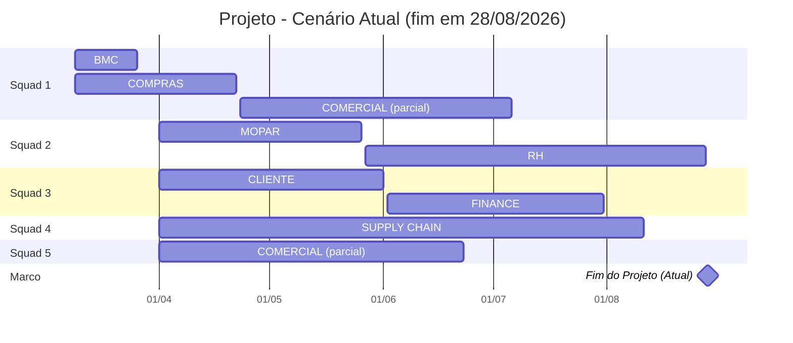
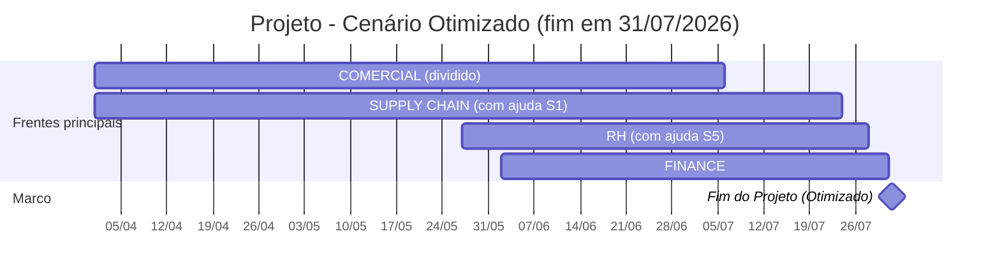

# Timeline do Projeto (Gantt)

## 1) Cenário atual — COMERCIAL dividido entre Squad 1 e Squad 5

## 2) Cenário otimizado — menor prazo encontrado

Premissa vencedora:

- COMERCIAL dividido (Squad 1 + Squad 5)
- depois Squad 1 ajuda SUPPLY CHAIN
- depois Squad 5 ajuda RH

